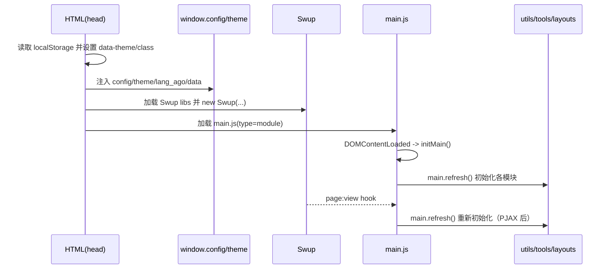

# 整体架构

## 类型与边界

- **项目类型**：纯静态站点前端（浏览器端执行），不包含后端服务代码。
- **核心能力**：页面渲染（HTML 已静态生成）+ 前端增强（导航、PJAX、搜索、代码块、暗黑模式、TOC、懒加载等）。
- **配置来源**：由页面内联脚本注入 `window.config` 与 `window.theme`；前端模块通过这些对象控制功能开关与参数。
  - 见 [index.html](file:///workspace/index.html#L191-L196)

## 运行时核心：Swup（PJAX）

页面底部引入 Swup 及其插件，并创建 `swup` 实例用于 PJAX 页面切换（局部替换 `#swup` 容器）：

- Swup 初始化：见 [index.html](file:///workspace/index.html#L662-L691)
- 容器：`containers: ["#swup"]`
- 插件：
  - `SwupScriptsPlugin({ optin: true })`：允许带 `data-swup-reload-script` 的脚本在切换后重载
  - `SwupProgressPlugin`：切换进度条
  - `SwupScrollPlugin({ offset: 80 })`：滚动位置处理
  - `SwupSlideTheme({ mainElement: ".main-content-body" })`：切换动画
  - `SwupPreloadPlugin`：预加载

这导致一个关键约束：**任何“依赖 DOM 节点”的前端增强逻辑，都必须在 `page:view`（切换完成）后重新初始化**。

## 初始化链路（Lifecycle）

### 1) 防止主题闪烁（FOUC）

页面 `<head>` 里首先执行一段同步脚本，读取 `localStorage` 的主题状态，并尽早设置：

- `document.documentElement.dataset.theme`
- `html` 上的 `dark/light` class
- `body` 上的 `dark-mode/light-mode` class（DOM ready 后补齐）

代码位置：见 [index.html](file:///workspace/index.html#L10-L65)。

### 2) 全局配置注入

主题渲染时注入：

- `window.config`：站点根路径等（例如 `root`）
- `window.theme`：大量主题配置（功能开关、样式、文案等）
- `window.lang_ago`：相对时间的国际化文本
- `window.data`：页面级数据（例如 masonry 开关）

代码位置：见 [index.html](file:///workspace/index.html#L191-L196)。

### 3) Swup 初始化

在页面底部同步加载 Swup 库并创建全局 `swup` 变量：见 [index.html](file:///workspace/index.html#L662-L691)。

### 4) ESModule 功能模块加载与“二次初始化”

页面底部以 `type="module"` 方式加载模块（从 `/js/build/*`），其中：

- 入口模块：[main.js](file:///workspace/js/main.js#L1-L85)
  - `DOMContentLoaded` → `initMain()` → `main.refresh()`
  - `swup.hooks.on("page:view")` → `main.refresh()`
  - 见 [main.js](file:///workspace/js/main.js#L74-L85)

`main.refresh()` 负责统一初始化各子模块，并根据 `theme` 配置启用/禁用能力：见 [main.js](file:///workspace/js/main.js#L47-L71)。

## 模块分层

- **入口层**：`/js/main.js`（统一 refresh，控制子模块启动）
- **基础工具层**：`/js/utils.js`（滚动状态、视图高度、字体缩放、工具栏折叠、相对时间等）
- **布局增强层**：`/js/layouts/*`（导航收缩、TOC、懒加载、分类/书签/随笔页面等）
- **通用工具层**：`/js/tools/*`（暗黑模式、滚动到顶/底、代码块复制、TOC 显示开关、图片查看器、本地搜索等）
- **可选插件层**：`/js/plugins/*`（Typed、Mermaid、Pangu、Tabs、HBE 等）
- **第三方库层**：`/js/build/libs/*`（Swup、anime、Typed、moment、odometer 等）

## 关键状态与数据流

### 样式状态（localStorage）

`main.styleStatus` 作为运行时 UI 状态的统一存储，并序列化到 localStorage：

- key：`REDEFINE-THEME-STATUS`
- 字段：`isDark`、`fontSizeLevel`、`isOpenPageAside` 等
- 见 [main.js](file:///workspace/js/main.js#L17-L46)

### 依赖注入（全局变量）

该代码基于以下全局变量工作（由 HTML 注入或第三方库暴露）：

- `config` / `theme` / `lang_ago`（页面内联注入）
- `swup`（Swup 初始化脚本创建）
- `anime` / `mermaid` / `Typed` / `moment` / `Odometer` 等（按需加载）

## 初始化时序图

